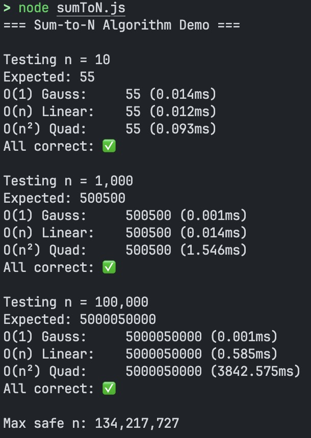

# Sum-to-N Algorithm Performance Demo

## 🚀 How to Run

### Local (Recommended for accurate benchmarks)
```bash
node sumToN.js
```

### Online Playground
[**Try it on RunJS**](https://runjs.app/play/#Ly8gc3VtVG9OLmpzIOKAlCBTaW1wbGUgTm9kZS5qcyBkZW1vIGNvbXBhcmluZyBzdW0gYWxnb3JpdGhtcwoKY29uc3QgTUFYX1NBRkVfU1VNID0gTnVtYmVyLk1BWF9TQUZFX0lOVEVHRVI7CmNvbnN0IE1BWF9TQUZFX04gPSBNYXRoLmZsb29yKChNYXRoLnNxcnQoOCAqIE1BWF9TQUZFX1NVTSArIDEpIC0gMSkgLyAyKTsKCi8qKiBPKDEpIOKAlCBHYXVzcyBmb3JtdWxhICovCmZ1bmN0aW9uIHN1bUNvbnN0KG4pIHsKICBuID0gTWF0aC5mbG9vcihuKTsKICBpZiAobiA8PSAwKSByZXR1cm4gMDsKICByZXR1cm4gbiAlIDIgPT09IDAgPyAobiAvIDIpICogKG4gKyAxKSA6ICgobiArIDEpIC8gMikgKiBuOwp9CgovKiogTyhuKSDigJQgc2ltcGxlIGxvb3AgKi8KZnVuY3Rpb24gc3VtTGluZWFyKG4pIHsKICBuID0gTWF0aC5mbG9vcihuKTsKICBpZiAobiA8PSAwKSByZXR1cm4gMDsKICBsZXQgcyA9IDA7CiAgZm9yIChsZXQgaSA9IDE7IGkgPD0gbjsgaSsrKSBzICs9IGk7CiAgcmV0dXJuIHM7Cn0KCi8qKiBPKG5eMikg4oCUIG5lc3RlZCBpbmNyZW1lbnRzIChGSVhFRCkgKi8KZnVuY3Rpb24gc3VtUXVhZHJhdGljKG4pIHsKICBuID0gTWF0aC5mbG9vcihuKTsKICBpZiAobiA8PSAwKSByZXR1cm4gMDsKICBsZXQgcyA9IDA7CiAgZm9yIChsZXQgaSA9IDE7IGkgPD0gbjsgaSsrKSB7CiAgICBmb3IgKGxldCBqID0gMTsgaiA8PSBpOyBqKyspIHsKICAgICAgcysrOwogICAgfQogIH0KICByZXR1cm4gczsKfQoKLyoqIEJlbmNobWFyayBoZWxwZXIgKi8KZnVuY3Rpb24gYmVuY2htYXJrKGZuLCBuKSB7CiAgY29uc3QgdDAgPSBwZXJmb3JtYW5jZS5ub3coKTsKICBjb25zdCByZXN1bHQgPSBmbihuKTsKICBjb25zdCB0MSA9IHBlcmZvcm1hbmNlLm5vdygpOwogIHJldHVybiB7IHJlc3VsdCwgbXM6IHQxIC0gdDAgfTsKfQoKLy8gRGVtbwpmdW5jdGlvbiBydW5EZW1vKCkgewogIGNvbnNvbGUubG9nKCI9PT0gU3VtLXRvLU4gQWxnb3JpdGhtIERlbW8gPT09XG4iKTsKCiAgY29uc3QgdGVzdFZhbHVlcyA9IFsxMCwgMTAwMCwgMjAwMF07CgogIHRlc3RWYWx1ZXMuZm9yRWFjaCgobikgPT4gewogICAgY29uc29sZS5sb2coYFRlc3RpbmcgbiA9ICR7bi50b0xvY2FsZVN0cmluZygpfWApOwogICAgY29uc29sZS5sb2coYEV4cGVjdGVkOiAkeyhuICogKG4gKyAxKSkgLyAyfWApOwoKICAgIGNvbnN0IHIxID0gYmVuY2htYXJrKHN1bUNvbnN0LCBuKTsKICAgIGNvbnN0IHIyID0gYmVuY2htYXJrKHN1bUxpbmVhciwgbik7CiAgICBjb25zdCByMyA9IGJlbmNobWFyayhzdW1RdWFkcmF0aWMsIG4pOwoKICAgIGNvbnNvbGUubG9nKGBPKDEpIEdhdXNzOiAgICAgJHtyMS5yZXN1bHR9ICgke3IxLm1zLnRvRml4ZWQoMyl9bXMpYCk7CiAgICBjb25zb2xlLmxvZyhgTyhuKSBMaW5lYXI6ICAgICR7cjIucmVzdWx0fSAoJHtyMi5tcy50b0ZpeGVkKDMpfW1zKWApOwogICAgY29uc29sZS5sb2coYE8obsKyKSBRdWFkOiAgICAgJHtyMy5yZXN1bHR9ICgke3IzLm1zLnRvRml4ZWQoMyl9bXMpYCk7CgogICAgY29uc3QgYWxsQ29ycmVjdCA9IHIxLnJlc3VsdCA9PT0gcjIucmVzdWx0ICYmIHIyLnJlc3VsdCA9PT0gcjMucmVzdWx0OwogICAgY29uc29sZS5sb2coYEFsbCBjb3JyZWN0OiAke2FsbENvcnJlY3QgPyAi4pyFIiA6ICLinYwifVxuYCk7CiAgfSk7CgogIGNvbnNvbGUubG9nKGBNYXggc2FmZSBuOiAke01BWF9TQUZFX04udG9Mb2NhbGVTdHJpbmcoKX1gKTsKfQoKcnVuRGVtbygpOwo=)

## ⚠️ Performance Timing Note

Online JavaScript playgrounds often have **timing limitations** that affect `performance.now()` accuracy:

## Example screenshot

## 📸 Screenshot



## 📊 What This Demo Shows

- **O(1) Gauss Formula**: Constant time regardless of n
- **O(n) Linear Loop**: Time scales linearly with n
- **O(n²) Quadratic**: Time scales quadratically with n (fixed from original buggy implementation)

All three algorithms produce the same correct result: `n × (n + 1) / 2`