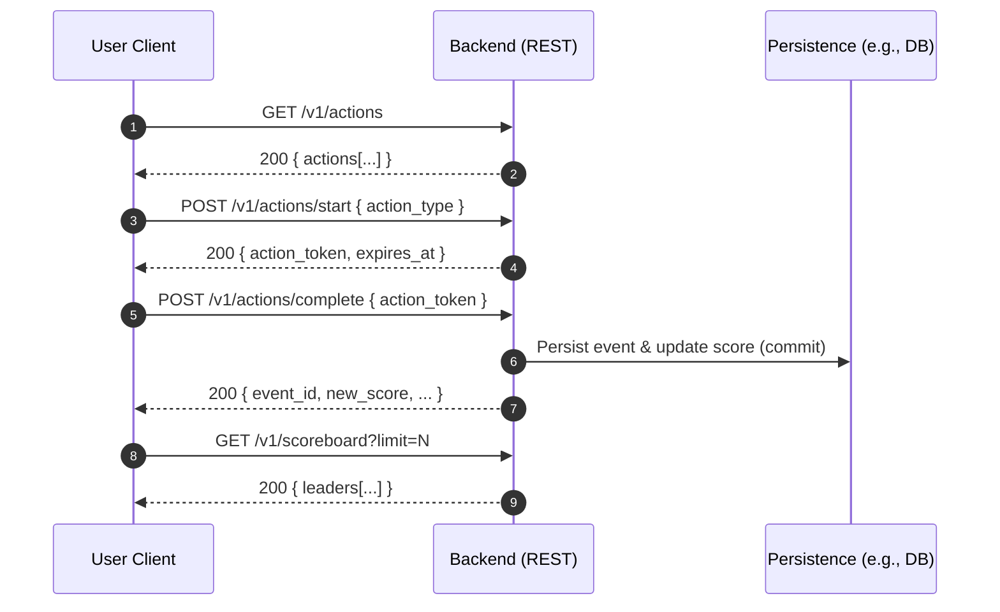
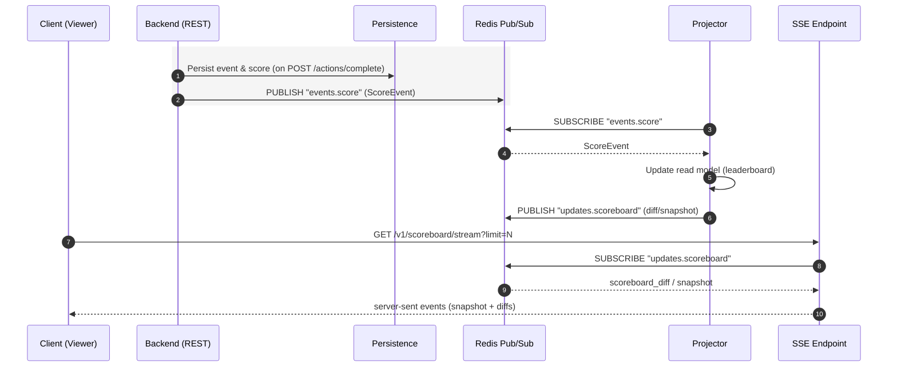

# Scoreboard — Contracts-Only README
*(REST works independently; Redis Pub/Sub only augments realtime via SSE)*

## Independence Guarantee
- **REST-only mode requires no Redis or SSE.** Users can:
  1) **Get available actions** (and server-authoritative points),  
  2) **Start an action** (receive an action token),  
  3) **Complete an action** (award points), and  
  4) **Get the scoreboard** — all via REST.
- **Realtime mode** is optional. **Redis Pub/Sub** feeds a projector and a **Server-Sent Events (SSE)** endpoint for live updates. If Redis/SSE is unavailable, REST continues to function.

---

## Modes of Operation
- **Mode A — REST-only (independent)**: REST endpoints below are sufficient for all user flows.
- **Mode B — Realtime-enhanced**: Add Redis Pub/Sub + SSE for sub-second updates to connected clients.

---

## Conventions
- JSON over HTTP with `Content-Type: application/json`.
- Timestamps are RFC-3339 (UTC).
- Auth via `Authorization: Bearer <userJWT>`.
- Idempotent writes: `Idempotency-Key: <uuid>` header (recommended).

---

## REST Endpoints (independent core)

### 0) List Available Actions (server-authoritative)
**GET** `/v1/actions`
> Returns the set of allowed `action_type` values and the points the server will award.

**200 OK**
```json
{
  "actions": [
    { "action_type": "quiz-complete", "points": 5, "enabled": true },
    { "action_type": "share-referral", "points": 2, "enabled": false }
  ],
  "as_of": "2025-08-26T09:00:00Z"
}
```

---

### 1) Issue Action Receipt (optional but recommended)
**POST** `/v1/actions/start`  
**Auth:** Bearer token  
**Purpose:** Mint a short-lived server-signed token for a chosen `action_type`.

**Request**
```json
{ "action_type": "quiz-complete" }
```

**200 OK**
```json
{
  "action_token": "<JWT>",     // includes {sub, act, pts, exp, jti}
  "expires_at": "2025-08-26T09:00:00Z"
}
```

**Errors**: `401 unauthorized`, `400 unknown_action_type`, `429 rate_limited`

---

### 2) Complete Action (submit result)
**POST** `/v1/actions/complete`  
**Auth:** Bearer token  
**Headers (recommended):** `Idempotency-Key: <uuid>`

**Request**
```json
{
  "action_token": "<JWT from /v1/actions/start>",
  "client_action_id": "c9f1e4d2-6a0b-4c3a-9a55-1c8c33bce001"
}
```

**200 OK**
```json
{
  "event_id": "9c2db4d4-2f2e-4c89-9eaa-2b0b2f6a77b8",
  "user_id": "b0f6b7a2-3d11-4f6e-9c1a-48b8c3d51ee1",
  "action_type": "quiz-complete",
  "delta": 5,
  "new_score": 123,
  "updated_at": "2025-08-26T09:00:02Z"
}
```

**Errors**: `400 invalid_action_token`, `401 unauthorized`,  
`409 duplicate_event`, `429 rate_limited`, `500 internal_error`

---

### 3) Get Current Top-N (snapshot / polling)
**GET** `/v1/scoreboard?limit=10`

**200 OK**
```json
{
  "limit": 10,
  "as_of": "2025-08-26T09:00:02Z",
  "leaders": [
    { "user_id": "u1", "display_name": "Alice", "score": 320 },
    { "user_id": "u2", "display_name": "Bob",   "score": 295 }
  ]
}
```

---

## Optional Realtime (SSE) — depends on Redis Pub/Sub
> This section is **optional**. If disabled, the REST endpoints above still provide full functionality.

### SSE endpoint
**GET** `/v1/scoreboard/stream?limit=10`  
**Response:** `text/event-stream` with events:
```
event: scoreboard.snapshot
data: { "as_of":"2025-08-26T09:00:02Z","limit":10,"leaders":[...] }

event: scoreboard.diff
data: { "as_of":"2025-08-26T09:00:03Z","changes":[{"user_id":"...","old_rank":12,"new_rank":9,"score":123}] }
```

---

## Redis Pub/Sub Contracts (used only for realtime)

### Channel A — Raw Score Events (internal)
**Channel:** `events.score`  
**Produced by:** Backend after successful `/v1/actions/complete`.

**Message — `ScoreEvent`**
```json
{
  "type": "score_event",
  "event_id": "9c2db4d4-2f2e-4c89-9eaa-2b0b2f6a77b8",
  "user_id": "b0f6b7a2-3d11-4f6e-9c1a-48b8c3d51ee1",
  "action_type": "quiz-complete",
  "points": 5,
  "occurred_at": "2025-08-26T09:00:02Z",
  "metadata": { "client_action_id": "c9f1e4d2-6a0b-4c3a-9a55-1c8c33bce001" }
}
```

### Channel B — Client-Facing Scoreboard Updates
**Channel:** `updates.scoreboard`  
**Produced by:** Projector after updating the read model.

**Diff Update**
```json
{
  "type": "scoreboard_diff",
  "as_of": "2025-08-26T09:00:02Z",
  "changes": [
    { "user_id": "b0f6...ee1", "score": 123, "old_rank": 12, "new_rank": 9 }
  ],
  "limit_hint": 10
}
```

**Snapshot Update**
```json
{
  "type": "scoreboard_snapshot",
  "as_of": "2025-08-26T09:00:02Z",
  "limit": 10,
  "leaders": [
    { "user_id": "u1", "display_name": "Alice", "score": 320 },
    { "user_id": "u2", "display_name": "Bob",   "score": 295 }
  ]
}
```

---

## Diagrams

### A) REST-only (independent) flow


### B) Realtime-enhanced (Redis Pub/Sub + SSE) flow


---

## Common Error Body (all REST 4xx/5xx)
```json
{
  "error": "invalid_action_token",
  "message": "Action token expired or not for this user"
}
```

---
